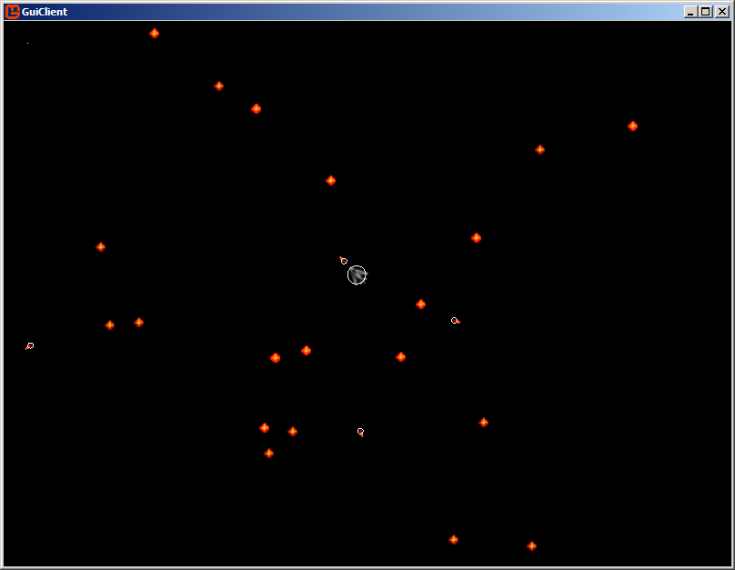

# StarBots (Beta!)

Это онлайн-мультиплеер игра, разработанная специально для ботов и ботоводов.

Игрок управляет космическим кораблем, который может собирать звездочки и стрелять по остальным кораблям.  За сбор звездочек и убийство противников начисляются очки. Цель игры набрать как можно больше очков. 



## Сервер

Сервер работает по адресу `ws://62.173.140.96:80` по протоколу WebSocket

Обмен командами с сервером осуществляется посредством JSON сообщений.

При соединении сервер присылает объект GameInfo (см. GameInfo.cs)

```json
{
    "Version":"0.1",
	"Key":"3nsWtIY+S0S0QTGn",
    "MyId":1604985217,
    "ShipRadius":6.0,
    "MaxSpeed":10.0,
    "ShootingCooldown":10
}
```

В нем указываются основные параметры мира игры.

В дальнейшем сервер каждые 100 мс присылает JSON пакет с состоянием мира (см. GameState.cs):

```json
{
	"Players":[{"vel":{"x":0.0,"y":0.0},"id":951494319,"last_tick":11853,"score":0,"pos":{"x":30.0,"y":-172.0},"r":10.0}],
	"Dust":[
		{"pos":{"x":292.0,"y":184.0},"r":2.0},{"pos":{"x":-163.0,"y":228.0},"r":2.0},
		{"pos":{"x":-234.0,"y":286.0},"r":2.0},{"pos":{"x":181.0,"y":-278.0},"r":2.0},
		{"pos":{"x":-122.0,"y":203.0},"r":2.0},{"pos":{"x":-251.0,"y":-32.0},"r":2.0},
		{"pos":{"x":59.0,"y":-12.0},"r":2.0},{"pos":{"x":-108.0,"y":-176.0},"r":2.0},
		{"pos":{"x":120.0,"y":61.0},"r":2.0},{"pos":{"x":-293.0,"y":51.0},"r":2.0},
		{"pos":{"x":-40.0,"y":124.0},"r":2.0},{"pos":{"x":128.0,"y":-142.0},"r":2.0},
		{"pos":{"x":-101.0,"y":-71.0},"r":2.0},{"pos":{"x":190.0,"y":158.0},"r":2.0},
		{"pos":{"x":-113.0,"y":-148.0},"r":2.0},{"pos":{"x":-82.0,"y":-152.0},"r":2.0},
		{"pos":{"x":-67.0,"y":-63.0},"r":2.0},{"pos":{"x":95.0,"y":-271.0},"r":2.0},
		{"pos":{"x":37.0,"y":-70.0},"r":2.0},{"pos":{"x":-283.0,"y":-35.0},"r":2.0}],
	"Bullets":[],
	"Tick":11853
}
```

Состояние содержит массивы с расположением игроков, их скоростей, расположением звезд (dust) и снарядов.

Для управления своим кораблем необходимо отослать на сервер JSON (PlayerAction.cs)

```json
{
    "key":"rflkEdXvvkKqjyt6",
    "force":{"x":19.99997,"y":135.0},
    "Shoot":true
}
```

key - ключ, полученный из сообщения GameInfo

force - вектор силы, точка плоскости куда лететь кораблю

shoot - сделать ли выстрел. На стрельбу имеется кулдаун. 

## Соединение с сервером. Вариант 1.

Для соединения с сервером вы можете самостоятельно написать WebSocket клиент на любом удобном языке.

## Соединение с сервером. Вариант 2.

Есть графический клиент GuiClient

* <a href=files/GuiClient_src.zip)>files/GuiClient_src.zip - исходники</a>
* <a href=files/GuiClient_src.zip)>files/GuiClient_exe.zip - бинарник</a>

Графический клиент позволяет соединиться с сервером и поиграть в игру с помощью мыши. Программе необходим .NET 4.6.1

GuiClient может служить как прокси для соединения с игровым сервером. Он умеет читать стандартный ввод и отправлять его на сервер, а на стандартный вывод выводить ответы от сервера.

Также на экране будет видно что вообще происходит в игре.

Таким образом, GuiClient можно запустить из своей программы, перенаправить его ввод и вывод и работать с сервером без WebSockets

Ниже приведу как подключиться к GuiClient на C#

```C#
static string dir = "d:\\GuiClient\\";
static string exe = dir+"GuiClient.exe";
static void Main(string[] args)
{
      ProcessStartInfo info = new ProcessStartInfo();
      info.FileName = exe;
      info.WorkingDirectory = dir;
	  info.RedirectStandardInput = true;	// перенаправляем ввод
      info.RedirectStandardOutput = true;	// перенаправляем вывод

      info.UseShellExecute = false;

       var p = Process.Start(info);		// Запускаем процесс
       Console.SetIn(p.StandardOutput);	// перенаправляем свой ввод
       Console.SetOut(p.StandardInput);	// перенаправляем свой вывод

       string l = Console.ReadLine();
       var i = JsonSerDes.DeserializeGameInfo(l);	// считываем GameInfo

       while (true)
       {
           PlayerAction action = new PlayerAction(i.Key, new Vector2D(0, 0));
           string output = JsonSerDes.Serialize(action);	// Отправляе мдействие
           
           Console.WriteLine(output);
           string state = Console.ReadLine();	// Считываем новое состояние мира
       }
 }
```


## Игровая физика

Игровая физика описана в Game.cs


